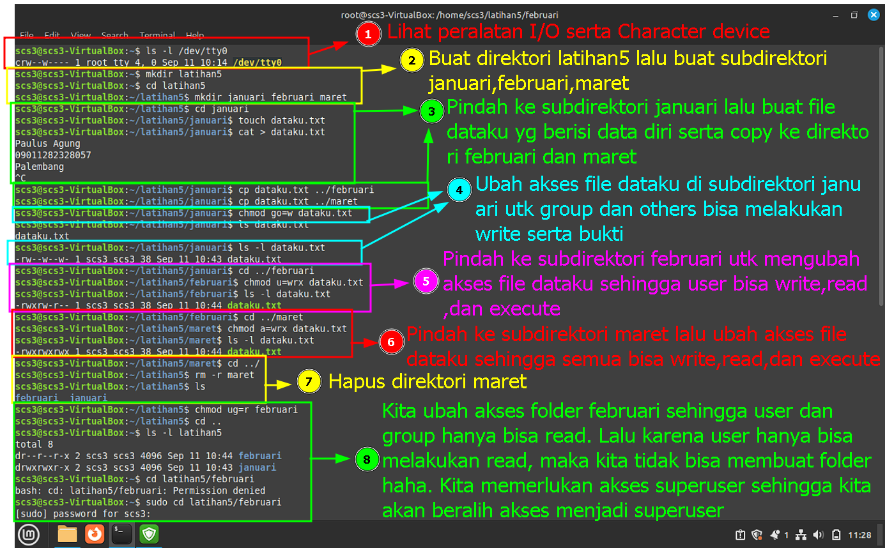

## Tugas 4

Nama: Paulus Agung Putratama

NIM: 09011282328057

Kelas: SK3C

  

  
  

    
## Penjelasan tentang akses suatu file atau direktori
    
  -UUUGGGOOO
  
  Setiap 3 huruf mewakili akses yang dimiliki user(u), group(g), atau others(o)
  
  huruf pertama adalah read(r), huruf kedua adalah write(w), huruf ketiga adalah execute(e)
  
  contoh -rwx--xrw-

  berarti user memiliki akses read, write, execute. group memiliki akses hanya untuk execute. Others memiliki akses untuk
  read dan write
  
  -----------------------------------------------------------
  
  

  
  

